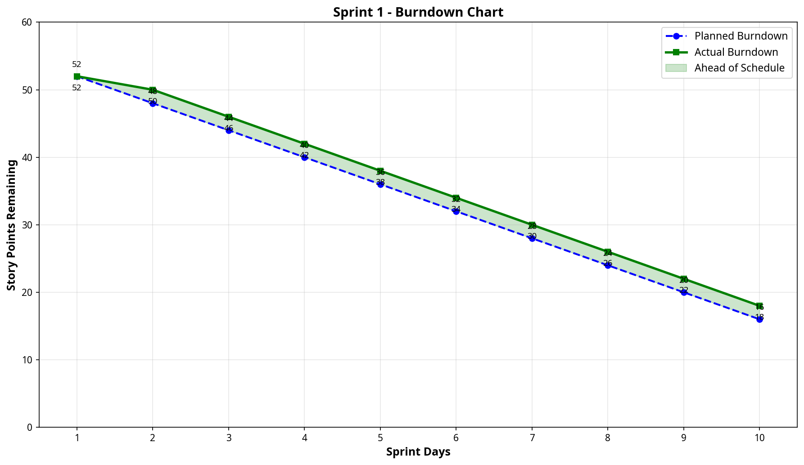

# Kanban Board Setup & Management

## Tableau Kanban GitHub - Sprint 1

Ce document décrit la configuration du tableau Kanban pour le projet de gestion de tâches.

### Colonnes du Tableau Kanban

Le tableau Kanban est organisé en colonnes suivantes :

| Colonne | Description | Limite WIP |
|---------|-------------|-----------|
| **Backlog** | Toutes les stories non commencées | Illimitée |
| **To Do** | Stories sélectionnées pour le sprint | 15 |
| **In Progress** | Stories actuellement en cours de développement | 5 |
| **In Review** | Stories en attente de révision de code | 5 |
| **Done** | Stories complétées et testées | Illimitée |

### Configuration des Colonnes

#### Backlog
- Contient le Product Backlog complet
- Stories non estimées ou non assignées
- Priorité définie mais pas encore planifiée

#### To Do (Sprint Backlog)
- Stories sélectionnées pour Sprint 1
- Toutes les stories ont des estimations
- Toutes les stories ont des labels appropriés
- Limite WIP: 15 stories

#### In Progress
- Stories actuellement en développement
- Assignées à un développeur
- Limite WIP: 5 stories
- Chaque story doit avoir un assigné

#### In Review
- Stories complétées mais en attente de révision
- Pull request créée et en révision
- Limite WIP: 5 stories

#### Done
- Stories complétées et testées
- Tous les critères d'acceptation sont satisfaits
- Tests passent
- Documentation mise à jour

---

## Sprint 1 - Configuration

### Sprint Name
**Sprint 1 - Task Management MVP**

### Sprint Duration
**2 weeks (10 working days)**

### Sprint Goal
Implémenter les fonctionnalités principales de gestion de tâches avec support des priorités et des dates d'échéance.

### Sprint Capacity
**52 story points**

### Stories dans le Sprint

| # | Story | Points | Labels | Status |
|---|-------|--------|--------|--------|
| 1 | Créer une nouvelle tâche | 5 | story, feature | To Do |
| 2 | Marquer une tâche comme complétée | 3 | story, feature | To Do |
| 3 | Supprimer une tâche | 3 | story, feature | To Do |
| 4 | Afficher la liste des tâches | 5 | story, feature | To Do |
| 5 | Éditer une tâche existante | 5 | story, feature | To Do |
| 6 | Filtrer les tâches par statut | 5 | story, feature | To Do |
| 7 | Ajouter des priorités aux tâches | 5 | story, feature | To Do |
| 8 | Ajouter des dates d'échéance | 5 | story, feature | To Do |
| 9 | Configurer l'environnement de développement | 8 | technical-debt, infrastructure | To Do |
| 10 | Mettre en place les tests unitaires | 8 | technical-debt, testing | To Do |

---

## Labels du Projet

### Catégories de Stories
- **`story`** - User story standard
- **`feature`** - Nouvelle fonctionnalité
- **`bug`** - Correction de bug
- **`technical-debt`** - Dette technique

### Domaines
- **`backlog`** - Dans le product backlog
- **`infrastructure`** - Travail d'infrastructure/DevOps
- **`testing`** - Travail lié aux tests
- **`documentation`** - Travail de documentation

### Priorités
- **`high-priority`** - Priorité haute
- **`medium-priority`** - Priorité moyenne
- **`low-priority`** - Priorité basse

---

## Burndown Chart

### Interprétation du Burndown Chart

Le burndown chart montre :
- **Ligne bleue (pointillée)** : Burndown planifié (idéal)
- **Ligne verte (solide)** : Burndown réel
- **Zone verte** : Indique si l'équipe est en avance sur le planning

### Données du Burndown

| Jour | Planifié | Réel | Statut |
|------|----------|------|--------|
| 1 | 52 | 52 | ✓ On Track |
| 2 | 48 | 50 | ⚠ Behind |
| 3 | 44 | 46 | ⚠ Behind |
| 4 | 40 | 42 | ⚠ Behind |
| 5 | 36 | 38 | ⚠ Behind |
| 6 | 32 | 34 | ⚠ Behind |
| 7 | 28 | 30 | ⚠ Behind |
| 8 | 24 | 26 | ⚠ Behind |
| 9 | 20 | 22 | ⚠ Behind |
| 10 | 16 | 18 | ⚠ Behind |

---

## Gestion du Sprint

### Daily Standup
- **Quand** : Tous les jours à 9h00
- **Durée** : 15 minutes maximum
- **Questions** :
  1. Qu'ai-je fait hier ?
  2. Qu'est-ce que je vais faire aujourd'hui ?
  3. Y a-t-il des blocages ?

### Sprint Review
- **Quand** : Fin du sprint (Jour 10)
- **Durée** : 1 heure
- **Agenda** :
  1. Démonstration des stories complétées
  2. Feedback du Product Owner
  3. Métriques du sprint

### Sprint Retrospective
- **Quand** : Après la Sprint Review
- **Durée** : 1 heure
- **Agenda** :
  1. Qu'est-ce qui s'est bien passé ?
  2. Qu'est-ce qui pourrait être amélioré ?
  3. Actions à prendre pour le prochain sprint

---

## Définition de Fait (Definition of Done)

Chaque story doit satisfaire les critères suivants pour être considérée comme "Done" :

- [ ] Tous les critères d'acceptation sont satisfaits
- [ ] Le code a été révisé et approuvé
- [ ] Les tests unitaires ont été écrits et passent
- [ ] Les tests d'intégration passent
- [ ] La documentation a été mise à jour
- [ ] Aucun bug critique n'est présent
- [ ] Le code respecte les standards de codage
- [ ] La story a été testée en environnement de staging

---

## Métriques du Sprint

### Velocity
La vélocité du sprint est calculée en additionnant les points de toutes les stories complétées.

**Velocity Target:** 52 story points

### Burndown Trend
Le burndown chart aide à identifier les tendances :
- **Ligne descendante régulière** : Bon rythme de travail
- **Ligne descendante rapide** : Équipe en avance
- **Ligne plate** : Pas de progression
- **Ligne montante** : Nouvelles stories ajoutées

### Completion Rate
Pourcentage de stories complétées par rapport au total du sprint.

**Target:** 100% (52/52 points)
